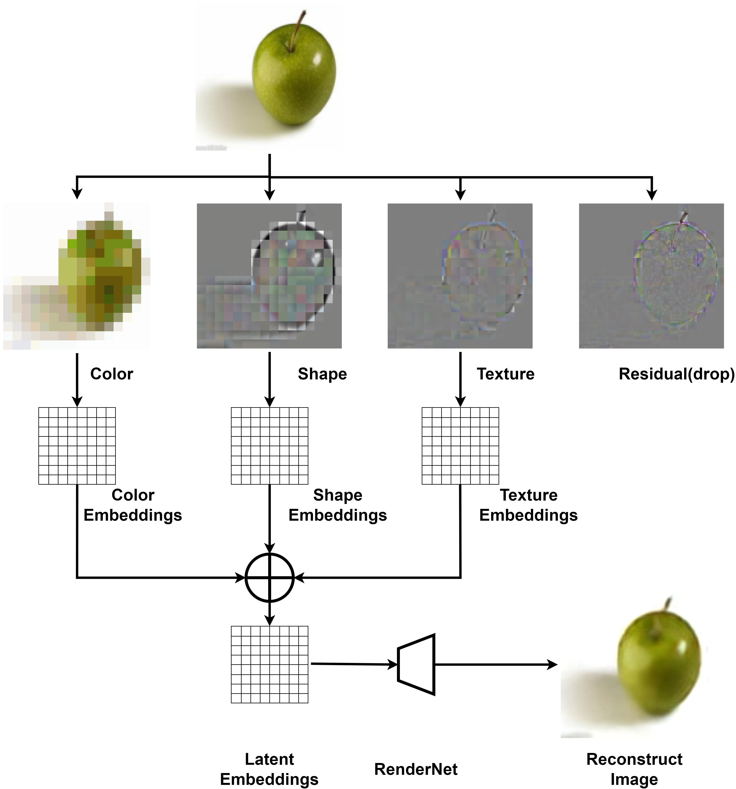

# CST-AutoEncoder
This project is designed for the AMD Pervasive AI Developer Contest. Its goal is to design an easy-to-deploy AutoEncoder for Ryzen AI PC.
# The idea to separate Color, Shape, and Texture from the image and reconstruct the image by RenderNet



# Get Start
At first, you should have an AMD Ryzen AI Powered PC.

Then you should open the NPU device in BIOS, and install the drivers and applications for the PC.

Open the NPU device in Bios and Install [NPU driver](https://ryzenai.docs.amd.com/en/latest/inst.html)

Install the [Ryzen AI Software](https://ryzenai.docs.amd.com/en/latest/inst.html)

Install [wsl2](https://learn.microsoft.com/en-us/windows/wsl/install) and [docker](https://docs.docker.com/desktop/install/windows-install/).

Download the checkpoint and minitrain3 datasets from [Google Drive](https://drive.google.com/file/d/1pknX4-zAIZlRBdwJbnaJZN2VbH7siUiK/view?usp=sharing)

And put the checkpoint and minitrain3 into the quantization folder.
# Quantization
You can follow the [readme](.\quantization\readme.md) to quantify the model.

# Test the float models
Get the reconstructed images from original images
```
python .\rendernet_amd_block.py --input-file .\ILSVRC2012_val_00045087.JPEG --output-file reconstructed_image.png --mode encode_render 
```
Get the patches' categories from original images
```
python .\rendernet_amd_block.py --input-file .\ILSVRC2012_val_00045087.JPEG --output-file test_img_patch_cls.pth --mode encode --patch-cls
```
Get the patches' embeddings from original images
```
python .\rendernet_amd_block.py --input-file .\ILSVRC2012_val_00045087.JPEG --output-file test_img_patch_embed.pth --mode encode
```
Get the reconstructed images from the patch embeddings
```
python .\rendernet_amd_block.py --input-file .\test_img_patch_embed.pth --output-file reconstructed_image.png --mode render
```
# Test the quantization models with onnx session
Get the reconstructed images from original images
```
python .\rendernet_onnx.py --input-file .\ILSVRC2012_val_00045087.JPEG --output-file reconstructed_image.png --mode encode_render --checkpoint quantization\quantization_results_512\Sequential_int.onnx --img 512
```
Get the patches' categories from original images
```
python .\rendernet_onnx.py --input-file .\ILSVRC2012_val_00045087.JPEG --output-file test_img_patch_cls.pth --mode encode --patch-cls --checkpoint quantization\quantization_results_512\Sequential_int.onnx --img 512
```
Get the patches' embeddings from original images
```
python .\rendernet_onnx.py --input-file .\ILSVRC2012_val_00045087.JPEG --output-file test_img_patch_embed.pth --mode encode --checkpoint quantization\quantization_results_512\Sequential_int.onnx --img 512
```
Get the reconstructed images from the patch embeddings
```
python .\rendernet_onnx.py --input-file .\test_img_patch_embed.pth --output-file reconstructed_image.png --mode render --checkpoint quantization\quantization_results_512\Sequential_int.onnx --img 512
```
## Test the benchmark with 256*256 resolution
On NPU device
```
python .\rendernet_onnx.py --mode benchmark --checkpoint quantization\quantization_results_256\Sequential_int.onnx --target NPU --img-size 256
```
You can get the results with 'Average inference time per run: 0.0866 seconds on NPU device'

On CPU device
```
python .\rendernet_onnx.py --mode benchmark --checkpoint quantization\quantization_results_256\Sequential_int.onnx --target CPU --img-size 256
```
You can get the results with 'Average inference time per run: 0.0974 seconds on CPU device'
## Test the benchmark with 512*512 resolution
On NPU device
```
python .\rendernet_onnx.py --mode benchmark --checkpoint quantization\quantization_results_512\Sequential_int.onnx --target NPU --img-size 512
```
You can get the results with 'Average inference time per run: 0.2966 seconds on NPU device'

On CPU device
```
python .\rendernet_onnx.py --mode benchmark --checkpoint quantization\quantization_results_512\Sequential_int.onnx --target CPU --img-size 512
```
You can get the results with 'Average inference time per run: 0.3707 seconds on CPU device'